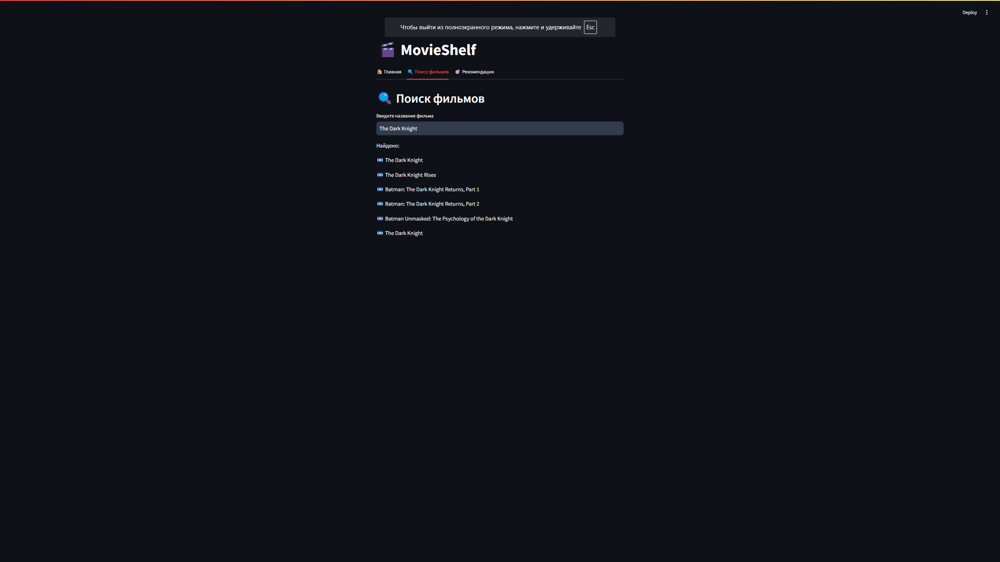
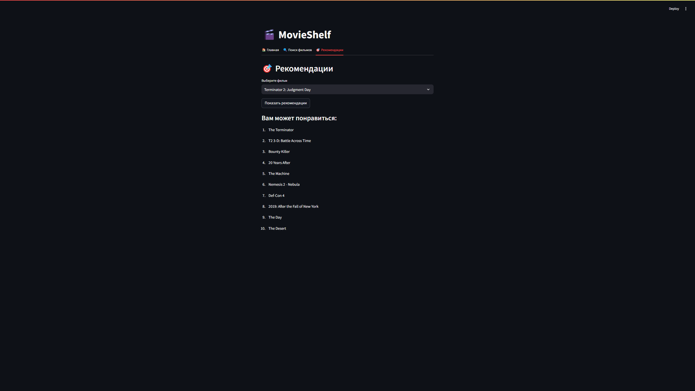

# 🎬 MovieShelf

**MovieShelf** — это веб-приложение, которое позволяет искать фильмы и получать персонализированные рекомендации на основе их содержимого. Используя методы машинного обучения и обработки текста, приложение анализирует описание и ключевые слова фильмов, чтобы предложить схожие фильмы, которые могут вам понравиться.

## Особенности:
- **Поиск фильмов**: Возможность искать фильмы по названию.
- **Рекомендации**: Получение рекомендаций на основе выбранного фильма, с использованием модели, обученной на TF-IDF и cosine similarity.

## Установка и запуск

1. Клонируйте репозиторий:
   ```bash
   git clone https://github.com/Boo4kin/Movieshelf.git
   ```

2. Перейдите в каталог проекта:
   ```bash
   cd Movieshelf
   ```

3. Установите необходимые библиотеки:
   ```bash
   pip install -r requirements.txt
   ```

4. Запустите приложение:
   ```bash
   streamlit run app.py
   ```

5. Откроется веб-страница с интерфейсом, где вы сможете искать фильмы и получать рекомендации.

## Используемые технологии:
- **Streamlit** — для создания веб-интерфейса.
- **Pandas** — для обработки данных.
- **Scikit-learn** — для построения модели рекомендаций с использованием TF-IDF и cosine similarity.
- **Pickle** — для сохранения и загрузки обученной модели.

## Данные:
- **movies_metadata.csv**: Основные данные о фильмах.
- **credits.csv**: Информация о съемочной группе.
- **keywords.csv**: Ключевые слова для фильмов.

## Скриншоты




